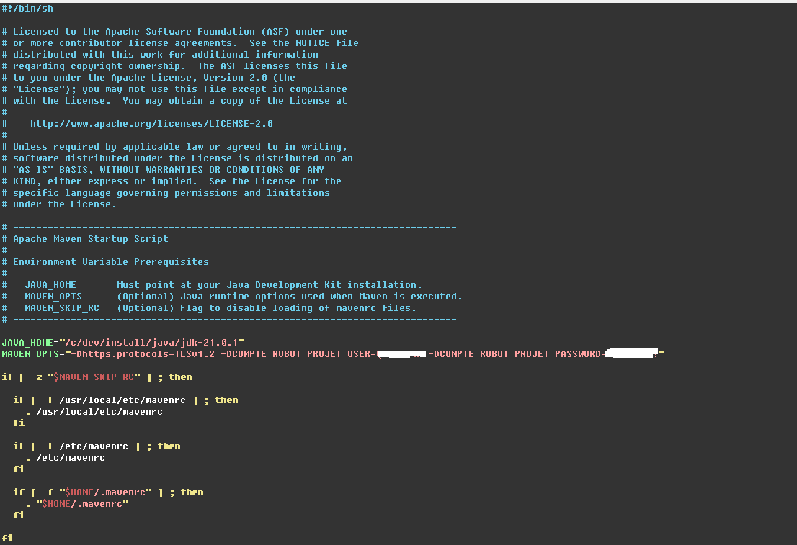

# ohnotjavaagain
I am in a position where I have to raise the level of a colleague in Java pretty quickly (3 months).
There are so many Java tutorials in the internet, but I wanted to keep it very simple and pretty pragmatic.

I want anyone to be able to go in a Java project quickly, this is the aim of this repo. You are an advanced Java programmer ? You should not need this repo, but I am open to any remarks !

# Summary

- [Prerequisites](#prerequisites)
- [Installation](#installation)
  - [Install JDK](#install-jdk)
  - [Install Maven](#install-maven)
    - [Unpack Maven Archive](#unpack-maven-archive)
    - [Configure Maven with java](#configure-maven-with-java)
- [How to test your solution](#how-to-test-your-solution)
- [How to follow this project and work on the exercices](#how-to-follow-this-project-and-work-on-the-exercices)
- [Modules](#modules)
  - [01 pojo](#01-pojo)
  - [02 equals hashcode toString](#02-equals-hashcode-tostring)
  - [03 interface](#03-interface)
- [Contributing](#contributing)

# Prerequisites

- You also need at least Java Development Kit 21 known as [JDK 21](https://jdk.java.net/21). Choose the archive matching your OS.
- You must have download the latest version of [maven](https://maven.apache.org/download.cgi).

# Installation

All installation is described for a Windows environment !

## Install JDK

The JDK will compile your code. Unpack the archive in a dedicated place. In our example our JDK lays in _**c:\dev\install\java\jdk-21.0.1**_
folder.


## Install Maven

### Unpack Maven Archive

To make it simple, Maven is the guy who will build all your java project reading you [pom.xml](pom.xml) file. This file
describe for instance the java version to use, the dependencies needed to build the project. It will avoid you the painful
task to compile your project with [javac](https://docs.oracle.com/en/java/javase/21/docs/specs/man/javac.html).

Unpack the maven archive in a dedicated place. For our example we use _**c:\dev\install\apache-maven-3.9.5**_ path.
Please note that we may not use the latest version of Maven when you read this file.


### Configure Maven with java

A quick way to force Maven to use a specific version consists in changing **mvn.cmd**.
directly.

**mvn.cmd** lays in **_<MAVEN_LOCATION>/bin_**. Set JAVA_HOME variable like in the screenshot below:



# How to test your solution
Go a module, for example [01_pojo](01_pojo) then run
```bash
mvn clean install
```

If you pass the unit tests, it means that your solution is correct (not necessary the best, but it is working for sure)

Solution is laying in tags: `git checkout solution/01_pojo` will show you the solution for [01_pojo](01_pojo). Next solution
will include the previous ones.

# How to follow this project and work on the exercices

Just make a regular pull to get all new modules. I suggest to create your own branch to add your solutions.
```bash
git checkout -b yourBranch main
```
To keep your branch up to date with the new modules you can perform the following command:
```bash
git rebase main yourBranch
```

# Modules

## 01 pojo

Learn to create a plain old java object, this is the very basis ! Go to [01_pojo](01_pojo).

## 02 equals hashcode toString

Learn to create the winning Tuple3 for a good java bean ! Go to [02_equals_hashcode_tostring](02_equals_hashcode_tostring)

## 03 interface

Understand the interface concept in a street fight theme ! Go to [03 interface](03_interface)

# Contributing

This project is very new, but I accept anybody to help me.

## Maintaining solutions branch up to date with all tags

Each commit from the **solutions** branch must match to the whole solution for module, moreover each commit from this
branch is also tagged like **solutions/<module name>**.

To keep the branch up to date, we need to rebase it on top of main branch moving all tags. For this purpose you can use
[rebase_solutions_with_tags.sh](internal/rebase_solutions_with_tags.sh) if you are working with **git bash**.

## Authors

Quang-Minh TRAN